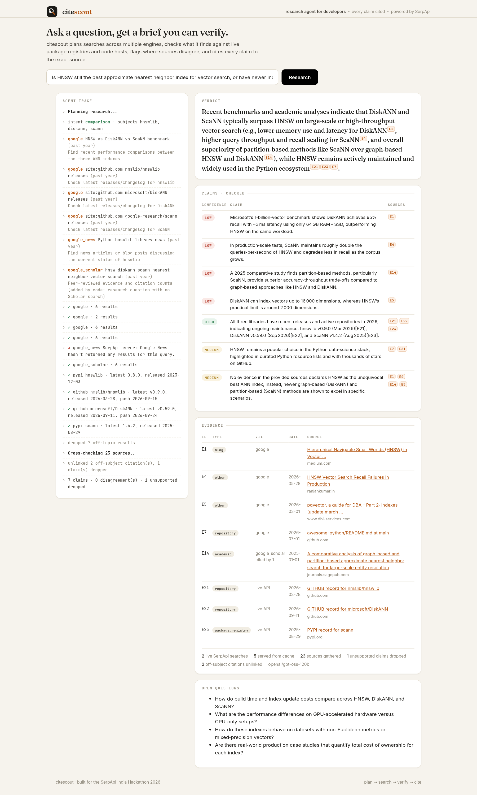
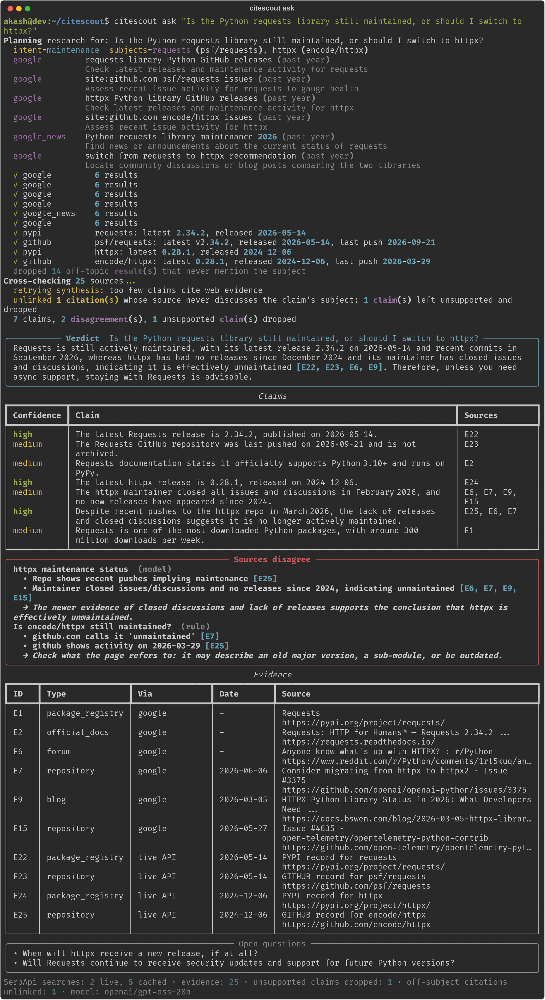
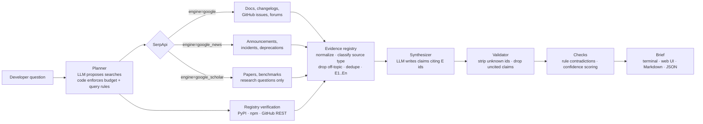

# citescout

[](https://github.com/akashrajeev/citescout/actions/workflows/tests.yml)

**A developer research agent that is not allowed to show you an unsourced claim.** Unlike a "research brief bot" that asks a model to summarize search results, citescout checks the model's work in code: citations must point at retrieved evidence **and** at a source that actually discusses the claim's subject, facts are cross-checked against live PyPI / npm / GitHub registry data, download counts and OSV.dev security advisories, confidence is computed from the sources rather than written by the model, and contradictions are detected twice (by the model and by deterministic rules).

Ask it things like *"Is the Python requests library still maintained, or should I switch to httpx?"*, *"Should I upgrade Pydantic v1 to v2 in a FastAPI project?"* or *"Is HNSW still the best approximate nearest neighbor index?"*. citescout plans searches across Google, Google News, Google Scholar and Google Trends through SerpApi, verifies what it finds, and writes a short brief where **every claim links to the evidence behind it**, with a separate section for the places where sources disagree. Use it from the terminal, a local web UI, or any MCP client.



Built for the [SerpApi India Hackathon 2026](https://serpapi.github.io/serpapi-india-hackathon-2026/), AI Agents track.

**Demo video (1:52):** https://youtu.be/7EF9pnAYh-I - a live run of the requests-vs-httpx question in the web UI, then the CLI budget check and the test suite.

---

## Why

Asking a chatbot "is X still maintained?" gets you a confident answer from training data that may be a year old. Searching yourself means opening ten tabs of release notes, GitHub issues, Reddit threads and blog posts that often disagree. citescout does the ten tabs for you, and it is built so it **cannot** show you a claim it can't source:

- Evidence gets stable ids (`E1`, `E2`, ...). The model may only cite those ids.
- After the model answers, code removes any citation that points at nothing and drops claims left with no valid source.
- A second code gate (`citescout/support.py`) checks that each cited source discusses the subject the claim names, and never lets a passing mention inside some other project's repository be a claim's only support. Both counts (claims dropped, citations unlinked) are shown in every brief.
- It runs a second research round. After the first draft passes the checks, code lists what it could not settle (claims no page confirmed, low-confidence claims, disagreements with no resolution, subjects no web source covers, the draft's open questions). The model turns those gaps into up to 2 targeted follow-up searches (`--followups N`, `0` for a single pass), and the brief is rewritten from the larger evidence pool. The gaps and the follow-up searches are shown in the trace and in the brief.
- Comparison questions ("X or Y?", "switch to Y?") get a side-by-side table built in code from primary data only: latest version and date, last push, archived, stars, weekly downloads, OSV advisories on the latest release, and Google Trends search interest through SerpApi's `google_trends` engine (1 credit, shown as a 12-month chart in the web UI). Every cell cites the record it came from.
- A deep-read pass (`citescout/deepread.py`) then fetches the cited pages themselves (free, no SerpApi credits) and checks each claim against the full text, not the two-line snippet: every version, number and date in the claim must appear in a cited page or live registry record. Each claim is marked `✓ page`, `~ snippet` or `✗ not found`, and a claim no cited page backs loses one confidence level with the missing fact named.
- Confidence (`high` / `medium` / `low`) is **computed from the sources**, not written by the model: independent domains, source type, freshness, and whether live registry data backs the claim.
- Contradictions are found twice: by the model reading the evidence, and by deterministic rules that compare what web pages say ("the latest version is 2.1", "this project is abandoned") with what PyPI / npm / GitHub actually record, and pages that say "no known vulnerabilities" while OSV.dev lists advisories against the latest release.

## Measured, not claimed

`citescout eval` runs a fixed question set, saves each brief to [`evals/`](evals/) and scores the checks ([full table](docs/eval.md)). Re-running it costs 0 SerpApi credits because searches, plans and pages are cached, and `--rescore` re-checks the saved briefs with no model call at all.

Current results on the three example questions: 22 shipped claims, 19 (86%) verified against a full page or live API record, 1 not found (confidence lowered), 2 unsupported claims dropped before shipping, 2 off-subject citations unlinked. Planted wrong facts caught: 12/12 (100%).

The planted-error test takes every claim the deep-read pass verified, changes one hard fact (2.34.2 -> 2.34.3, 2026 -> 2027), and checks it again against the same pages. It measures whether a wrong number would get through.

## What a run looks like

```
$ citescout ask "Is the Python requests library still maintained, or should I switch to httpx?"
Planning research for: Is the Python requests library still maintained, or should I switch to httpx?
  intent=maintenance  subjects=requests (psf/requests), httpx (encode/httpx)
  google         psf/requests releases site:github.com (past year)
                 official release notes and recent commit activity for requests
  google         encode/httpx releases site:github.com (past year)
                 official release notes and recent commit activity for httpx
  google         requests library maintenance status 2026 (past year)
                 determine if the Python requests library is still actively maintained
  google         httpx vs requests Python (past year)
                 compare features, performance, and community preference between httpx and requests
  google_news    Python requests library news 2026 (past year)
                 find any recent news about deprecation, security incidents, or major announcements
  google         psf/requests issues site:github.com (past year)
                 review recent open and closed issues to gauge maintenance activity
  ✓ google         6 results
  ✓ google         6 results
  ✓ google         6 results
  ✓ google         6 results
  ✓ google_news    6 results
  ✓ google         6 results
  ✓ pypi           requests: latest 2.34.2, released 2026-05-14
  ✓ github         psf/requests: latest v2.34.2, released 2026-05-14, last push 2026-09-21
  ✓ pypi           httpx: latest 0.28.1, released 2024-12-06
  ✓ github         encode/httpx: latest 0.28.1, released 2024-12-06, last push 2026-03-29
  dropped 13 off-topic result(s) that never mention the subject
Cross-checking 24 sources...
  8 claims, 1 disagreement(s), 0 uncited claim(s) dropped
```

followed by the verdict, a claims table with confidence and sources, a **Sources disagree** panel, and the evidence table:

<details>
<summary>Terminal brief (screenshot of a later run of the same question: the support gate unlinks one off-subject citation and drops the claim that depended on it)</summary>



</details>

Full example briefs (Markdown, with every link) are in [`examples/`](examples/), each with a **Review** section listing every claim-to-citation check and edit:

- [requests vs httpx](examples/requests-vs-httpx.md) - library maintenance / switch decision
- [moment.js alternatives](examples/momentjs-alternatives.md) - library maintenance / alternatives
- [is HNSW still the best ANN index?](examples/hnsw-ann-index.md) - research question, exercises **Google Scholar** with citation counts

There is also a local web UI (`citescout-web`) that streams the agent's steps live and renders the brief with clickable citations.

## How it works



| Stage | File | What it does |
|---|---|---|
| Plan | `citescout/planner.py` | The model returns a JSON plan: intent, the packages involved (with registry names and GitHub repos), and up to N searches, each with an engine, a query and a stated purpose. Code dedupes queries, rejects unknown engines, rewrites path-scoped `site:` operators that Google rarely matches, and caps the plan at the credit budget. |
| Search | `citescout/serp.py` | Runs the plan through SerpApi in parallel with a disk cache and a hard per-question credit cap. Normalizes the different response shapes into one `Evidence` type. |
| Verify | `citescout/registry.py` | Reads the latest version, release date, archived flag, last push and deprecation notices straight from PyPI, npm and the GitHub REST API. These become citable evidence rows too. |
| Filter | `citescout/agent.py` | Drops results that never mention the subject (a Google News search for "requests" happily returns library-funding news), marks project-named sites as official, and dedupes URLs. |
| Synthesize | `citescout/synthesize.py` | The model writes a verdict, 5-8 claims, contradictions and open questions using only the numbered evidence. If it leans only on registry rows, it is asked once more to ground claims in the web evidence. |
| Validate + check | `citescout/synthesize.py`, `citescout/support.py`, `citescout/checks.py` | Strips invalid citations, drops uncited claims, unlinks sources that never discuss the claim's subject, adds rule-based contradictions and computes confidence. |
| Render | `citescout/render.py`, `citescout/web/`, `citescout/mcp_server.py` | Rich terminal output, Markdown/JSON export, a small FastAPI + server-sent-events web UI, and an MCP server. |

All stages share typed Pydantic models (`citescout/models.py`): `SearchTask`, `Plan`, `Evidence` (with `SourceType`: official_docs, repository, package_registry, advisory, news, academic, forum, blog, other), `RegistryFact`, `Claim`, `Contradiction`, `Brief`.

## How citescout uses SerpApi

SerpApi is the agent's only window onto the web. Without it there is nothing to cite. It uses the official [`serpapi`](https://pypi.org/project/serpapi/) Python client (`serpapi.Client.search`) because the agent needs the full structured JSON of each engine (dates, sources, answer boxes, Scholar publication info), not a pre-formatted text summary.

| SerpApi API | Why citescout uses it | Parameters / fields used |
|---|---|---|
| **Google Search API** (`engine=google`) | The main source: official docs, changelogs, release notes, GitHub issues and discussions, migration guides, Stack Overflow and Reddit threads. `site:` operators let the planner aim one search at primary sources and another at independent ones, so every answer can be cross-checked. | `q`, `num`, `hl`, `gl`, `tbs=qdr:y` for past-year freshness; reads `answer_box`, `organic_results[].link/title/snippet/date/source` |
| **Google News API** (`engine=google_news`) | Things docs don't tell you: acquisitions, license changes, security incidents, maintainers stepping down, deprecation announcements. News results carry real timestamps, which feeds freshness scoring. | `q` (with Google News' `when:1y` operator for recency); reads `news_results[]` including nested `stories`, `source.name`, `iso_date` |
| **Google Scholar API** (`engine=google_scholar`) | Only for questions about algorithms, benchmarks or research claims ("is HNSW still the best ANN index?", see [the example](examples/hnsw-ann-index.md)). Citation counts are kept as a typed field and shown next to each paper. Code guarantees a research question gets at least one Scholar search, and the planner is told not to spend credits on Scholar for plain library questions. | `q`, `num`, `as_ylo` for recent work; reads `organic_results[].publication_info.summary`, `inline_links.cited_by.total` |
| **Account API** (`/account.json`) | `citescout budget` shows the credits left. The Account API is free and does not count against the monthly quota. | `plan_searches_left`, `searches_per_month` |

**Credit discipline** (the free plan is 250 searches a month):

- A hard per-question cap (`--max-searches`, default 8; the demo uses 6). The planner is told the cap, and code truncates the plan anyway.
- Every response is cached on disk by a hash of its parameters, so re-running a question or re-rendering a brief costs nothing. `--offline` answers from the cache only. API keys are scrubbed from anything written to disk.
- An empty past-year search is widened once (dropping the date filter) rather than re-planned.
- A timed-out search is retried once with identical parameters. SerpApi keeps its results for an hour and serves repeats of the same search from that cache for free, so the retry normally costs nothing.
- A typical question costs 5-6 searches.

## Setup

Requires Python 3.10+.

```bash
git clone https://github.com/akashrajeev/citescout.git
cd citescout
python -m venv .venv && source .venv/bin/activate
pip install -e '.[web,dev,mcp]'
cp .env.example .env
```

Fill in `.env`:

- `SERPAPI_API_KEY` - free key from https://serpapi.com/manage-api-key (250 searches/month).
- `LLM_API_KEY` - any OpenAI-compatible chat endpoint. The default is Groq's free tier (https://console.groq.com/keys) with `openai/gpt-oss-120b`, falling back to `openai/gpt-oss-20b` on rate limits. Set `LLM_BASE_URL` / `LLM_MODEL` to use OpenAI, Together, a local vLLM or Ollama server, etc.
- Optional: `GITHUB_TOKEN` raises the GitHub API limit from 60 to 5000 requests/hour. Not needed for normal use.

## Usage

```bash
# terminal
citescout ask "Is moment.js still maintained, or should I move to date-fns or Day.js?"
citescout ask "Should I upgrade from Pydantic v1 to v2 in a FastAPI project?" --max-searches 6 \
    --markdown brief.md --json brief.json
citescout ask "..." --offline      # replay from cache, 0 credits
citescout budget                  # credits left this month (free call)

# web UI at http://127.0.0.1:8000
citescout-web
```

### As an MCP server

`pip install -e '.[mcp]'` adds `citescout-mcp` (stdio). Any MCP client can then call two tools:
`research(question, max_searches=6, offline=False)`, which returns the verdict, claims with
confidence, both kinds of contradictions, the cited evidence (with Scholar citation counts), the
gate counters and a Markdown copy; and `serpapi_credits()`, which is free. Example client config:

```json
{
  "mcpServers": {
    "citescout": {
      "command": "citescout-mcp",
      "env": { "SERPAPI_API_KEY": "...", "LLM_API_KEY": "..." }
    }
  }
}
```

Run the tests (no network or keys needed; SerpApi and registries are faked):

```bash
pytest
```

## Limitations (honest list)

- **Snippets, not full pages.** Claims are grounded in the titles and snippets SerpApi returns, plus registry data. citescout does not fetch and read whole pages, so a snippet taken out of context can mislead it. The citation shows exactly which source to open.
- **The citation gates check that a source exists and discusses the claim's subject, not that it says exactly what the claim says.** The model can still over-read a snippet about the right library. That is why the example briefs carry a claim-by-claim review; confidence scoring and the contradiction rules reduce the risk, they don't remove it.
- **Registry checks cover PyPI, npm and GitHub only.** crates.io, Maven, Go modules etc. fall back to web evidence only. The planner has to guess the right package and repo names; a wrong guess just means no registry fact.
- **The rule checks are simple.** Version comparison looks at "latest/current version" phrasing near the package name; the dead-project rule looks for phrases like "no longer maintained" or "abandoned". They can miss things and occasionally misfire. Every rule-detected disagreement is labelled `rule` so you can tell it apart from the model's.
- **Freshness depends on what Google exposes.** Many organic results have no date. Scholar dates are year-only.
- **English, developer questions.** Prompts and heuristics are tuned for software-library questions in English. General research questions work, but with less cross-checking.
- **Free-tier limits.** 250 SerpApi searches a month is about 40 questions. Groq's free tier rate-limits bursts; the client falls back to a smaller model when that happens.

## Project layout

```
citescout/
  models.py       typed data model shared by all stages
  config.py       settings from env / .env
  planner.py      question -> SerpApi search plan
  serp.py         SerpApi engines, cache, budget, normalization, Account API
  classify.py     URL -> source type, source weights
  registry.py     PyPI / npm / GitHub verification
  llm.py          OpenAI-compatible JSON chat client
  synthesize.py   brief writing + citation validation
  support.py      second gate: does the cited source discuss the claim's subject?
  checks.py       rule contradictions + confidence scoring
  agent.py        the research loop
  render.py       terminal + Markdown output
  cli.py          `citescout` command
  web/            `citescout-web` (FastAPI + SSE, single HTML page)
  mcp_server.py   `citescout-mcp` (MCP tools: research, serpapi_credits)
tests/            offline tests with faked SerpApi responses
examples/         real briefs produced by citescout, hand-reviewed
docs/img/         screenshots
```

## AI tools used

Per the hackathon rules: this project was built with AI assistance. The code, tests and documentation were written with an AI coding agent working under my direction, and I reviewed and ran the results. At runtime, citescout itself uses an LLM (by default `openai/gpt-oss-120b` served by Groq) for search planning and for writing the brief. Citation checks, confidence scoring and the contradiction rules are plain code. The claim-by-claim reviews in `examples/` were also done by the AI coding agent. The demo video's voiceover is AI text-to-speech (lines in `demo/vo/`, mixed with `demo/mix_voiceover.py`).

## License

MIT - see [LICENSE](LICENSE).
